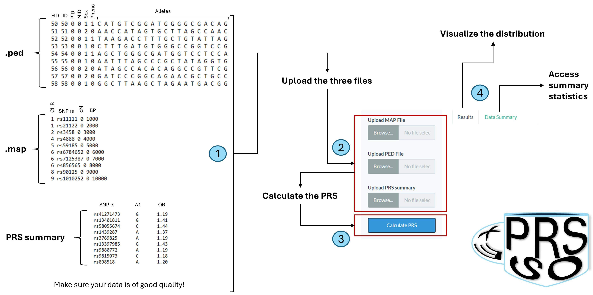

# exPRSso
exPRSso is an easy-to-use web application to replicate an already existing, published Polygenic Risk Scores (PRS) in your genetic data. Users are provided with a friendly interface for processing their genetic data files (.ped and .map) and generating both weighted and unweighted PRS calculations. The application leverages on published PRS summaries, reported as text file and containing these basic information: SNP (variant identifier), A1 (effect allele), and OR (effect size).

## Features
- Interactive web interface for uploading genetic data files (MAP, PED) and PRS summaries (SNPs and their risk alleles and effects)
- Supports large genetic datasets (up to 600MB file size)
- Calculates both weighted and unweighted PRS
- Visualizes PRS distributions through box and density plots
- Displays results in an interactive table
- Export both calculated scores and plots

## Development
exPRSso was born as a python code but then I remembered that R publishing solutions are way better. Unfortunately.
After (a time consuming) translation, the application is totally R-based and function thanks to these packages:
- tidyverse: dataframe manipulation and plot rendering
- R6: object programming. The whole PRS calculator (i.e., the expresso core) is based on that.
- ggplot2: plotting
- shiny: developing of the app
- shinydashboard: app layout
- DT: interactive data table

## Usage
1. **Upload Data Files**:
   - Upload your MAP file (.map): this is a mapping file reporting: CHR number (e.g., 1-22), SNP (variant identifier), genetic distance (cM), and base-pairs
   - Upload your PED file (.ped): this is a pedigree file that comes with the file.map. This file consists of 6 base columns (IID, FID, PID, MID, Sex, Phenotype) and a variable number of columns reporting the alleles for each SNP.
   - Upload your risk alleles file (.txt): this is the published PRS summary. This file should be composed by three columns: SNP (variant identified), A1 (effect allele), and OR (effect size). 

2. **Calculate PRS**:
   - Click the "Calculate PRS" button to process your data
   - The app will automatically calculate both weighted and unweighted scores

3. **View Results**:
   - Examine the distribution plots
   - Browse the detailed scores table
   - Download results in CSV format (and zipped plots)
   - 

## License
This project is licensed under the MIT License - see the [LICENSE](LICENSE) file for details.

## Contributing
Contributions are welcome! Please feel free to submit a Pull Request.

## Contacts
exPRSso has been developed by Alessio Felici at the University of Pisa. Plase, contact the author for any problem or questions about the app: alessio.felici@phd.unipi.it.  
